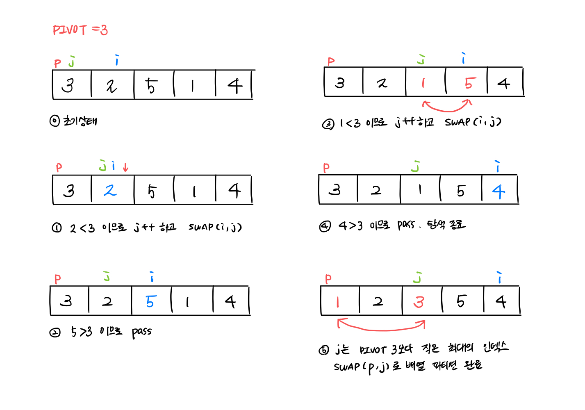

# 정렬 Sorting Problem


[](https://youtu.be/kPRA0W1kECg)
<br/>
<small>👆 Sound of Sorting</small>

정렬 알고리즘의 분류

* Stable Sorting : 중복된 원소의 순서가 정렬된 후에도 유지됨이 보장된다.
* Unstable Sorting : 중복된 원소의 순서가 정렬된 후에 유지됨이 보장되지 않는다.
  <small>K1, .., K2, .. 순서인 배열에서 정렬 후 K1, K2 임이 보장되면 stable, K2, K1일 수 있으면 unstable</small>
<br/><br/>
* in-place: 내부 정렬, 정렬을 위해 외부 배열이 필요하지 않다.
* not in-place: 외부 정렬, 정렬을 위해 외부 배열이 필요하다.

<br/>
🔥 핵심은 **교환/선택/삽입** 이다. 대부분의 정렬 알고리즘은 이 세 가지 개념을 응용한다.


## 1. O(N^2) 알고리즘

### 1. 교환 정렬 Exchange Sort
```python
  for i in range(0, N-1):
    for j in range(i+1, N):
      if A[i] < A[j]:
        swap(A[i], A[j])
```
### 2. 삽입 정렬 Insertion Sort
모든 `i = 0~N-1` 에 대해 `j = i-1`부터 0으로 내려가면서, 만약 `A[j] > A[i]` 이면 한 칸 앞으로 복사한다. 더 이상 `A[i]` 보다 큰 값이 없으면 반복문을 종료하고, `j+1` 포인터 자리에 `A[i]` 을 넣는다. 
```python
def insertion_sort():
  for i in range(1, N):
    next = A[i]
    for j in range(i-1, -1, -1):
      if A[j] > next:
        A[j+1] = A[j]
        break
    A[j+1] = next
```

### 3. 선택 정렬 Selection Sort
`i = 0~N-2` 에 대해, `j = i+1~N-1` 중 최댓값을 골라 `A[i]` 와 swap 한다.
```python
for i in range(0, N-1):
  m = i, min = A[m]
  for j in range(i+1, N):
    if A[j] < min:
      m = j
      min = A[j]
  swap(A[i], A[m])
```

### 4. 버블 정렬 Bubble Sort
`j = 0~N-1` 에 대해 `A[j], A[j+1]` 을 비교하여 작은 값이 앞에 있으면 swap 하는 것을 N번 반복한다.
```python
for i in range(0, N):
  for j in range(0, N-1):
    if A[j] > A[j+1]:
      swap(A[j], A[j+1])
```

### 5, 셸 정렬 Shell Sort 

## 2. O(logN) 알고리즘

### 1. 병합 정렬 Merge Sort

```
1. 배열을 두 부분 L, R 로 나눈다.
2. 각 부분을 정렬한다.
3. 두 배열을 순서대로 merge한다.
  i, j, k = 0
    while i < j:
      L[i]과 R[j]을 비교해 작은 값을 M[k]에 놓는다.
      더 작은 쪽의 포인터를 1 증가한다.
      
    i > len(L) 인 경우
      R배열의 남은 원소를 M에 놓는다.
    else
      L배열의 남은 원소를 M에 놓는다.
  M은 merge된 배열이다.
```
merge 구현 시 조심할 점

merged 배열인 M을 함수 내 로컬 변수로 선언하면서, 애초 인풋 길이인 N만큼의 배열을 선언했던 것이 오류였다. 항상 merge할 길이만큼의 배열만 선언하자. (👀 관련:  [병합 정렬의 merge 함수는 담당 범위보다 큰 연산을 하지 않는다.](https://www.acmicpc.net/board/view/109246))

### 2. 퀵 정렬 Quich Sort
```
1. 배열의 첫 번째 원소를 pivot으로 정한다.
2. pivot을 기준으로 pivot보다 작은 값을 왼쪽으로, 큰 값을 오른쪽으로 분리한다.
3. 왼쪽 부분을 정렬한다.
4. 오른쪽 부분을 정렬한다.
```
partition 함수는 간단히 함수 내 로컬 배열 L, R을 선언해 정렬한 다음, L + pivot + R 로 다시 합쳐 주는 방법이 있고, 교환을 이용해 pivot 인덱스를 찾는 방법이 있다.

partition 함수 원리

**Is Quick Sort Stable?** in-place는 stable 하지 않고 not in-place는 stable하다. 


### 3. 힙 정렬 Heap Sort
#### What is heap?
부모의 값이 자식의 값보다 큼/작음이 항상 보장되는 이진 트리 형식의 자료구조이다. 부모의 값이 자식의 값보다 항상 클 경우 max heap(최대 힙), 항상 작을 경우 min heap(최소 힙) 이라고 한다. max heap의 root는 힙의 최댓값이고, min heap의 root는 힙의 최솟값이다.

```python
1. heapify: 배열을 최대 힙으로 만든다.
  parent = 0~N//2까지의 노드에 대해
    while i > N//2
      if 자식 중 큰 값보다 크면 루프 종료
      else child 중 큰 값을 i에 놓는다.
      i = i//2 로 다음 자식 노드를 탐색
    parent를 빈 곳에 놓는다 A[i//2] = parent

2. 루트 노드와 엔드 노드를 swap한다
3. 마지막 노드를 제외한 0~N-1개의 노드를 heapify한다.
4. heapify할 노드가 없을 때까지 2-3 반복
```

기본적으로 선택 정렬의 응용, 즉 N번째 원소마다 최댓값을 확인하여 정렬하는 알고리즘이다. 그러나 최댓값을 산출하는 과정에서 root = max를 보장하는 heap 구조를 사용한다는 차이가 있다. heapify 함수는 복잡도가 O(logN)이므로, 전체 복잡도는 O(NlogN)이 된다.


---
### 3. What's more?
* Decision Tree
* Sorting by Distribution
* Bucket Sort, Radix Sort (MSD, LSD)
